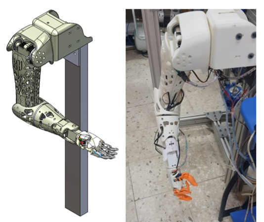

# Neural-IK-Humanoid-Robotic-Arm



## Overview

This repository presents a lightweight 6-DOF humanoid robotic arm integrating:

* Neural-network-based inverse kinematics
* PID optimization using GA, PSO, and HBA
* MATLAB / Simscape Multibody modeling
* Real-time embedded implementation using Teensy 4.1
* Experimental validation on physical hardware

The project was developed as part of a research study on intelligent and affordable humanoid manipulation systems.

---

# Features

* 6-DOF anthropomorphic robotic arm
* Lightweight 3D-printed structure
* 5-million-sample workspace dataset
* Zone-based neural inverse kinematics
* Forward and inverse kinematics
* System identification for all joints
* PID tuning using metaheuristic algorithms
* Simscape Multibody simulation
* Real-time embedded control using Teensy 4.1
* Experimental validation and trajectory tracking

---

# Repository Structure

```text
Neural-IK-Humanoid-Robotic-Arm/
│
├── CAD/
├── control/
├── dataset/
├── docs/
├── external_resources/
├── hardware/
├── kinematics/
├── nn_training/
├── simscape/
├── system_id/
├── videos/
└── workspace/
```

---

# Folder Descriptions

## /CAD

Contains CAD models, lightweight structural designs, and sample STEP files of the robotic arm.

## /control

Contains PID tuning scripts using:

* Genetic Algorithm (GA)
* Particle Swarm Optimization (PSO)
* Honey Badger Algorithm (HBA)

## /dataset

Contains dataset samples used for neural inverse kinematics training.

## /docs

Contains:

* Supplementary Information
* Figures
* Experimental photos
* Graphical abstract

## /external_resources

Contains external download links for:

* Full CAD assemblies
* Large datasets
* Experimental videos

## /hardware

Contains Teensy 4.1 firmware and embedded control implementation.

## /kinematics

Contains symbolic and numerical forward/inverse kinematics scripts.

## /nn_training

Contains neural-network training scripts and pretrained models.

## /simscape

Contains Simulink and Simscape Multibody models.

## /system_id

Contains system identification data and transfer-function estimation scripts.

## /videos

Contains trajectory tracking and experimental validation videos.

## /workspace

Contains workspace generation and dataset creation scripts.

---

# Software Requirements

* MATLAB R2023b
* Simulink / Simscape Multibody
* MATLAB Deep Learning Toolbox
* MATLAB System Identification Toolbox
* SOLIDWORKS 2022 SP5
* Arduino IDE 2.3

---

# Hardware Requirements

* Teensy 4.1 Microcontroller
* Servo motors
* External regulated power supply
* Bambu Lab X1C 3D Printer
* PLA filament (40% infill)

---

# Installation

## Clone Repository

```bash
git clone https://github.com/MostafaMahmoud98/Neural-IK-Humanoid-Robotic-Arm.git
```

## Open MATLAB

Add all folders to MATLAB path:

```matlab
addpath(genpath(pwd));
```

---

# Neural Inverse Kinematics

The inverse kinematics problem is solved using a zone-based neural network architecture.

* Workspace divided into 5 regions
* Dedicated neural network for each zone
* Dataset generated using forward kinematics
* Approximately 5 million samples

---

# Control Optimization

PID controllers are optimized using:

* Genetic Algorithm (GA)
* Particle Swarm Optimization (PSO)
* Honey Badger Algorithm (HBA)

Performance metrics include:

* Overshoot
* Settling time
* Steady-state error
* Tracking accuracy

---

# Experimental Validation

The robotic arm was experimentally validated using:

* Real-time trajectory tracking
* Workspace validation
* Step-response analysis
* Embedded hardware implementation

---

# External Resources

Large CAD assemblies and datasets are available externally due to GitHub storage limitations.

## Simscape Files

[Add your Google Drive or Zenodo link here.](https://fengbuedu-my.sharepoint.com/:f:/g/personal/mustafa_mahmoud_feng_bu_edu_eg/IgDwnvKL0MftTI0uu8EfR26uAa9j3MD-qh_77m_dvvp4D-4?e=qIZcEw)

## Full Dataset

[Add dataset link here.](https://fengbuedu-my.sharepoint.com/:u:/g/personal/mustafa_mahmoud_feng_bu_edu_eg/IQA2pgojbz74T5KtOFfe2908AXsn7DkmEhMwXiaGl9RJHQY?e=99IeS3)

## Experimental Videos

[Add video link here.](https://fengbuedu-my.sharepoint.com/:f:/g/personal/mustafa_mahmoud_feng_bu_edu_eg/IgCefj6fbzPsQKXhwvUWbxgzAedqS59uq-s0L4gDpFEWtQg?e=J2My6y)

---

# Citation

If you use this work, please cite:

```bibtex
@article{
}
```

---

# License

This project is licensed under the MIT License.

---

# Contact

Mustafa Mahmoud Elsayed

Faculty of Engineering – Mechatronics Department

For research collaboration or questions, please open an issue in this repository.

Email: mustafa.mahmoud@feng.bu.edu.eg

---

# Suggested Additional Files

## .gitignore

```gitignore
# MATLAB autosave
*.asv

# MATLAB backup files
*.m~

# Simulink generated files
*.slxc
*.autosave
*.mex*
*.mdl.r201*
*.slx.r201*

# Cache and temp
*.tmp
*.log

# OS files
.DS_Store
Thumbs.db

# Python cache
__pycache__/
*.pyc
```

---

# Suggested Release

Create:

```text
v1.0.0
```

Release description:

```text
Initial public release of the Neural IK Humanoid Robotic Arm platform.
```
